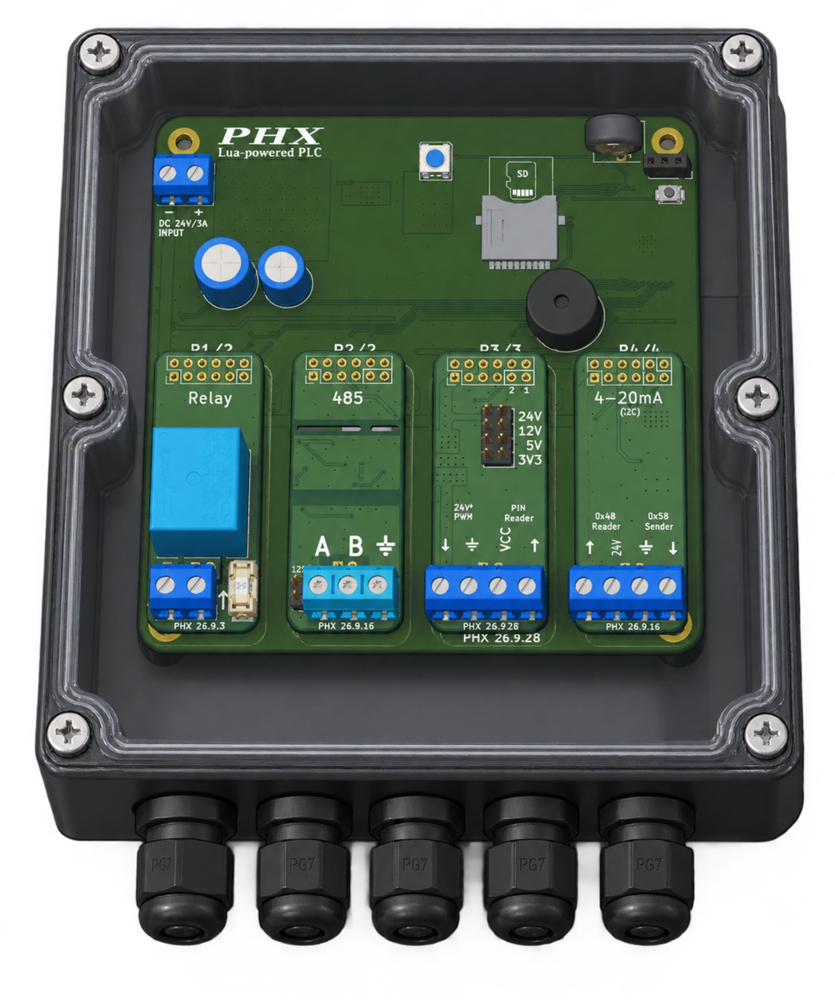

# PHXBox
Lua powered PLC

<p align="center">
  
</p>

## Overview

PHX Box is a modular, distributed real-time controller designed for modern industrial scenarios. Users do not need to learn traditional PLC languages; instead, they work with Lua, a modern programming language that is easier to learn and understand, while also offering richer functionality for developing more complex control logic and features.

It does not follow the traditional approach of "one chip does it all." Rather, it is built around distributed collaboration + script-based development + modular design, making industrial control as simple, flexible, and scalable as building with Lego blocks. It breaks down complex industrial control logic into multiple simple control units—each PHX Box handles just one simple logic unit, and multiple PHX Boxes work together to accomplish complex control logic. This ensures efficient control of each controlled device while also enabling greater control flexibility.

Even without a deep background in computer science or electronics, users can easily set up a modern control system with PHX Box.

## Core Design Concept

PHX Box runs on the kOS real-time operating system (developed in C) and exposes a Lua-based scripting engine, providing a lightweight yet powerful API for low-level hardware interaction—allowing PHX Box to be programmed with logic close to natural human language while achieving execution efficiency close to that of C.

Users can fully define the behavior and logic of PHX Box through three core files: init.lua, loop.lua, and event.lua.

- init.lua (Initialization Script): Used to declare the hardware circuit connection configuration of the PHX BOX and define common device operations and functions, laying the foundation for subsequent logic.
	
- loop.lua (Main Loop Script): kOS calls this file periodically every 10 seconds. The business logic within it is executed repeatedly at regular intervals, making it suitable for tasks that require continuous monitoring or state updates.
	
- event.lua (Event Response Script): This file handles various interrupt events triggered during PHX BOX runtime, including hardware interrupts (such as GPIO pin level changes and UART data reception) as well as communication interrupts (such as receiving messages from other network devices).

The invocation interval of loop.lua is approximately 10 seconds. However, this duration is not precise—the actual interval may vary slightly due to factors such as system load and task scheduling. Therefore, loop.lua is not suitable for process control scenarios that require strict timing accuracy. In fact, most tasks do not require strict real-time control, and this imprecise timing actually gives the system greater scheduling flexibility, resulting in higher efficiency and simpler implementation.

For millisecond-level precision timing control, please use the timer-based control functions provided by kOS, such as run_later (for single delayed execution) or run_periodic (for periodic execution).

The control logic in loop.lua and event.lua should be kept as concise and efficient as possible to ensure optimal system responsiveness and execution performance. If the execution time of any single run of either script exceeds 30 seconds, kOS will determine that the logic has entered a deadlock or an abnormal state, and will trigger an automatic system reboot to restore normal operation.

## Command-Line Tools

All interaction methods provided by PHX Box are based on Python library functions (Easy to Customize and Develop). We have encapsulated them into several commonly used command-line tools(Linux and Windows) for easy interaction with PHX Box:

- log.py – View the real-time operational status of the PHX Box directly from your computer for monitoring and debugging purposes.

```console
	$ python log.py 192.168.1.118
```

- sync\_files.py – Modify control scripts on the PHX Box at any time to flexibly adjust device behavior. Whether managing a single device or orchestrating dozens of units in a cluster, simply sync the control files to the gateway device with one command, and the gateway will automatically distribute them to the designated boxes—simple, efficient, and error-free.

```console
	$ python sync_files.py 192.168.1.118 ./path
```
- run\_lua\_on.py – Execute Lua script operations remotely on any PHX Box, such as querying device version information.

```console
	$ python run_lua_on.py 192.168.1.118 'return VERSION'
```

- download\_log.py – Download operational logs stored on the device's SD card to your local computer for offline analysis and troubleshooting.
	
	Since all SD card logs from every PHX Box are automatically aggregated to the Gateway device, users only need to download the logs from the Gateway—there is no need to log into each individual box to retrieve them separately.

```console
	$ python download_log.py 192.168.1.118
```
	
